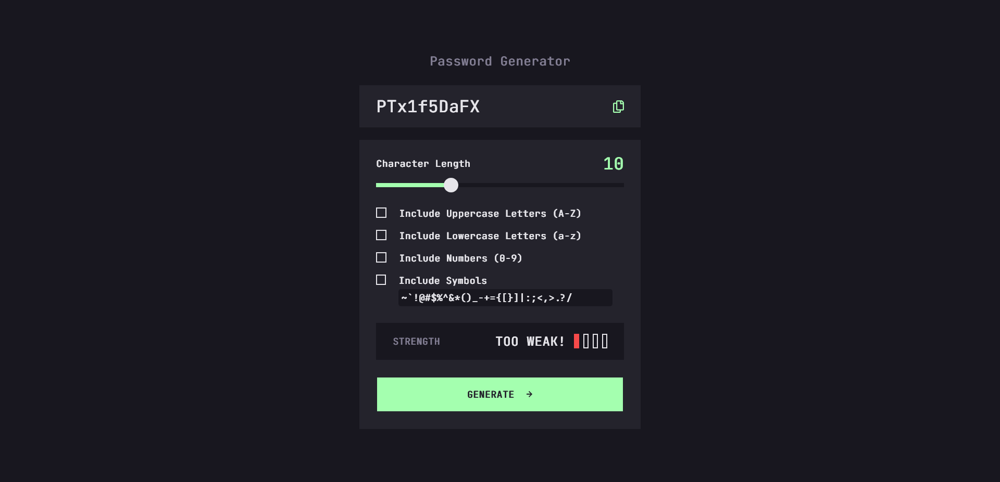
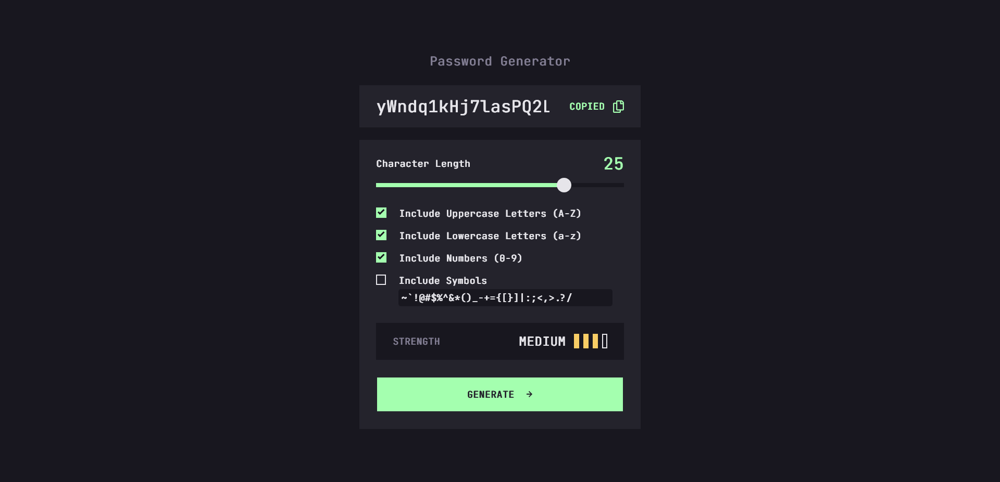

# Objective

Create a way for users to generate password with certain requirement, such as captial letter or a symbol.

**[Live Link](https://antran1245.github.io/password-generator/)**

## Password Strength

    

        

            <b style="color:#A4FFAF">STRONG</b>
            <ul>
                <li>Length greater than 15</li>
                <li>Uppercase</li>
                <li>Lowercase</li>
                <li>Numbers</li>
                <li>Symbols</li>
            </ul>
        

    

    

        

            <b style="color:#F8CD65">MEDIUM</b>
            <ul>
                <li>Length greater than 15</li>
                <li>At least 3 of the following:</li>
                <ul>
                    <li>Uppercase</li>
                    <li>Lowercase</li>
                    <li>Numbers</li>
                    <li>Symbols</li>
                </ul>
            </ul>
        

    

    

        

            <b style="color:#FB7C58">WEAK</b>
            <ul>
                <li>Length greater than 8 </li>
                <li>Uppercase</li>
                <li>Lowercase</li>
                <li>Numbers</li>
                <li>Symbols</li>
            </ul>
            
OR

            <ul>
                <li>Length greater than 15</li>
                <li>At least 2 of the following:</li>
                <ul>
                    <li>Uppercase</li>
                    <li>Lowercase</li>
                    <li>Numbers</li>
                    <li>Symbols</li>
                </ul>
            </ul>
        

    

    

        

            <b style="color:#F64A4A">TOO WEAK!</b>
            <ul>
                <li>Any Length</li>
                <li>With only one of the following:</li>
                <ul>
                    <li>Uppercase</li>
                    <li>Lowercase</li>
                    <li>Numbers</li>
                    <li>Symbols</li>
                </ul>
            </ul>
        

    

# Packages
- TypeScript
- Tailwind CSS
- Autoprefixer
- PostCSS

# Screenshots
**Default**

**Active**

# Credit

Project Provided by [Frontend Mentor](https://www.frontendmentor.io/challenges/password-generator-app-Mr8CLycqjh)